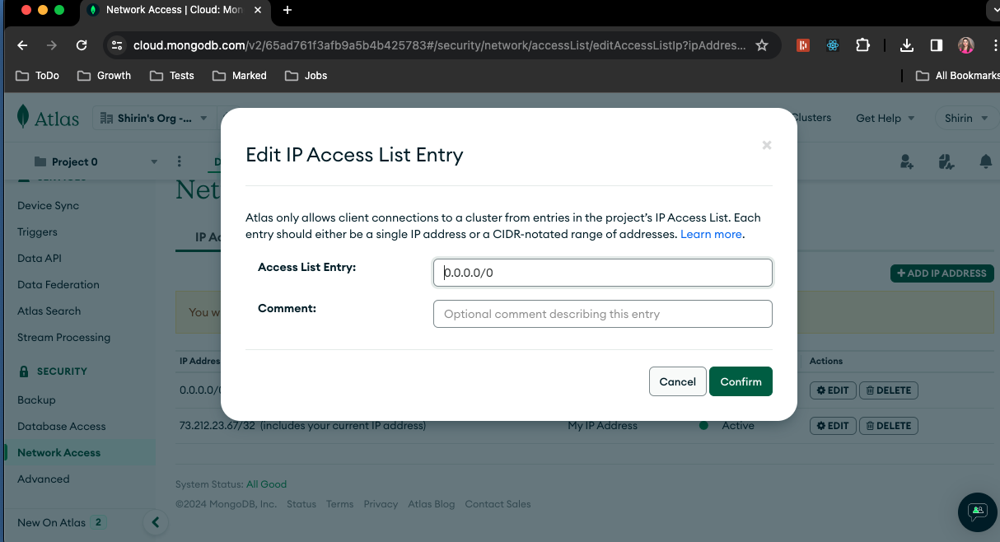

<p align="center">
  <a href="" rel="noopener">
 </a>
</p>

<h3 align="center">Ticket Management App</h3>

---

<p align="center"> This is a full CRUD NextJs App<br/>
<code>ticket-app</code> repository
    <br> 
</p>

## 📝 Table of Contents

- [About](#about)
- [Getting Started](#getting_started)
- [Tools](#tools)
- [Under The Hood](#function)
- [TODO](#todo)
- [Authors](#authors)
- [Acknowledgments](#acknowledgement)

## 🧐 About <a name = "about"></a>

This is a [Next.js](https://nextjs.org/) project bootstrapped with [`create-next-app`](https://github.com/vercel/next.js/tree/canary/packages/create-next-app). A Full CRUD NextJS app uses mongoDB (atlas connection) to create and manage help desk tickets. This app uses tailwind for styling.

### HOMEPAGE view

<image src="rm-assets/README-img1.png" width="600">

### CREATE NEW TICKET view

<image src="rm-assets/README-img2.png" width="600">

### UPDATE TICKET view

<image src="rm-assets/README-img3.png" width="600">

## 🏁 Getting Started <a name = "getting_started"></a>

### Prerequisites: What things you need to install the software and how to install them.

## ⛏️ Tools <a name = "tools"></a>

- [MongoDB](https://www.mongodb.com/) - Database
- [Mongoose](https://mongoosejs.com/docs/) - Database framework
- [Atlas](https://www.mongodb.com/atlas/database) - MongoDB Cloud Database
- [NextJS](https://nextjs.org/) - Web Framework
- [NodeJs](https://nodejs.org/en/) - Server Environment
- [Tailwind](https://tailwindcss.com/) - CSS Style Library

## 🚀 Start Here <a name = "start"></a>

### Installing

You can run this application locally by running `npm i`

### Running

in the main folder where you have package.json run the development server:

```bash
npm run dev
# or
yarn dev
# or
pnpm dev
# or
bun dev
```

Open [http://localhost:3000](http://localhost:3000) with your browser to see the result.

make sure you have the compatible version of the NodeJS if not run

```bash
nvn use 18.7.3
```

You can start editing the page by modifying `app/page.js`. The page auto-updates as you edit the file.

This project uses [`next/font`](https://nextjs.org/docs/basic-features/font-optimization) to automatically optimize and load Inter, a custom Google Font.

### Database

To run this app you need create an account on [Atlas](https://www.mongodb.com/atlas/database). You can create a free cluster and collection(Database) to store and retrieve your data.
Make sure your cluster is accessible via any ip address(not secure only recommended fot experimental projects):



Store this in your `env.local` and use it to connect with your cluster. Replace `admin` with your username created for the cluster and `password` with your password. <B><i>Do not check in or share your credentials!</B></i>

```JS
mongodb+srv://admin:<password>@cluster0.x9eegis.mongodb.net/?retryWrites=true&w=majority
```

you can manage data in the Atlas platform if you need to.

## 🔧 Under the Hood <a name = "function"></a>

In the Ticket Page user can:

- Create/record a new ticket including title, description, category priority, progress and status
  - "Title" is a text field and "Description" is a text area
  - Category and Status are dropdowns
  - Progress bar is made of 2 div(s)showing the progress with the help of CSS
  ```CSS
  style={{ width: `${progress}%` }}>
  ```

#### Nav Bar added tp `layout.js`, so it's available/visible on all the pages

```JS
export default function RootLayout({ children }) {
  return (
    <html lang="en">
      <body className={inter.className}>
        <div>
          <Nav />
            {children}
        </div>
      </body>
    </html>
  );
}
```

#### HomePage

Homepage or Dashboard displays all the tickets based on unique categories

```JS
  const { tickets } = await getTickets();

  const uniqueCategories = [
    ...new Set(tickets?.map(({ category }) => category)),
  ];
```

`getTickets()` is a GET call getting all the tickets from Atlas. Dashboard displays them by filtering them based on their unique category and generates `<TicketCard/>` component for each ticket

```JS
{tickets
    .filter((ticket) => ticket.category === uniqueCategory)
    .map((filteredTicket, _index) => (
    <TicketCard
        id={_index}
        key={_index}
        ticket={filteredTicket}
    />
    ))}
```

## (models) holds the Schema for Ticket Database

```JS
import mongoose, { Schema } from "mongoose";

mongoose.connect(process.env.MONGODB_URI);
mongoose.Promise = global.Promise;

const ticketSchema = new Schema(
    {
        title: String,
        description: String,
        category: String,
        priority: Number,
        progress: Number,
        status: String,
        active: Boolean,
    },
    {
        timestamps: true,
    }
);

const Ticket = mongoose.models.Ticket || mongoose.model("Ticket", ticketSchema);

export default Ticket;
```

## API calls

All API Calls are happening in `/api` directory in `route.js`.

To run CRUD for each Ticket we can create a dynamic route under api folder.
ex:`api/Tickets/[id]`

## TODOs <a name = "todo"></a>

1- Add Authentication

2- replace `fetch` with axios to call the back-end

3- move all links and credentials to the local .env instead of hardcoding them

## ✍️ Authors <a name = "authors"></a>

- [@shirinmjr](https://github.com/shirinmjr) - Built this as an experimental project

## 🎉 Acknowledgements <a name = "acknowledgement"></a>

- Free Code Camp
  - [Next.js, Tailwind CSS, and MongoDB Project Tutorial – Ticketing App](https://youtu.be/H0vhkoXljq0?si=iXnnBu-oiX94JzaV)
- Hat tip to anyone whose code was used
- Inspiration
- [Main Source code ](https://github.com/ClarityCoders/Ticket-Tutorial-App)
